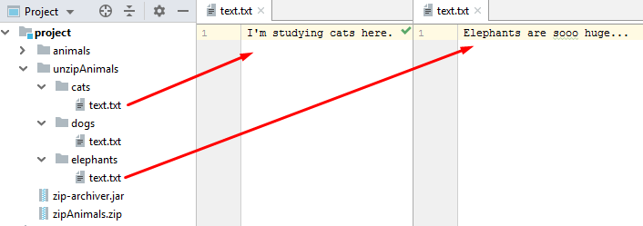

[](https://travis-ci.org/vermucht/zip-archiver)
[](https://codecov.io/gh/vermucht/zip-archiver)

# Консольный zip-архиватор

## Техзадание

1. Создать консольное приложение для создания zip-архива из файловой структуры.

1. Требуемые опции: 
    - Корневой каталог, где находятся нужные файлы и папки.
    - Расширения файлов, которые должны попасть в архив.
        
1. Целью задания было научиться работать с `java.util.ZipOutputStream`, а также научиться фильтровать файлы по их имени (расширению).

1. В процессе я увлекся и сделал не только архиватор, но и разархиватор 

## Как собрать

1. Для сборки потребуется [Maven](https://maven.apache.org/download.cgi), 
для запуска — [OpenJDK 11](https://jdk.java.net/11/).

1. [Скачать](https://github.com/vermucht/zip-archiver/archive/master.zip)
архив с исходным кодом из репозитория и распаковать 
(вместо этого можно просто клонировать репозиторий).

1. Перейти в папку проекта (`zip-archiver`). 
Запустить сборку при помощи Maven: 
    ```
    mvn clean package
    ```

1. Перейти в папку `target` и убедиться, что в ней появился файл `zip-archiver.jar`.

## Примеры использования

### Архивация проекта

1. Создадим в папке `project` простой [проект исследования животных](permalink:docs/animals), который называется `animals`.
    
    Для удобства положим также в папку `project` наш архиватор `zip-archiver.jar`.

    
    
1. Мы еще не знаем, как пользоваться программой, попробуем просто ее запустить. 
В ответ программа выдает подробную справку по использованию.
    ```
    $ project> java -jar zip-archiver.jar
    java -jar zip-archiver.jar
    === Simple zip archiver/unarchiver ===
         Usage: 'zip-archiver -a {action} -s {source} -o {output} -e {extensions}'
         Example: 'zip-archiver -a archive -s /home/john/project -o /home/john/my_project.zip -e xml,pdf,txt'
         Parameters:
           -a {action}: action to do. Values:
                archive: make zip archive from {source} folder to {output} file
                unarchive: unzip files from {source} archive to {output} folder
           -s {source}: folder with files to pack or zip file to unpack
           -o {output}: new zip file path or output folder to create and write archive contents to
           -e {extensions}, <optional>: extensions of files to take into archive,
               can work only on 'archive' action, ignored in 'unarchive action
    ```
    
1. Теперь мы знаем, как правильно написать команду! 
Нужно указать:
    - действие (запаковка / распаковка),
    - папку, где находятся файлы,
    - местоположение получившегося архива,
    - расширения файлов, которые надо положить в архив.
    
1. Я тут подумал... раз программа может фильтровать файлы, то можно взять в архив только *.txt*-файлы. 
    
    А файлы *.html* нам не потребуются - это из старых презентаций.
    
1. Ну что же, программа! Создай мне архив `zipAnimals.zip` и включи туда только текстовые файлы!
    ```
    $ project> java -jar zip-archiver.jar -a archive -s animals -o animals.zip -e txt
    ```
    
1. Архив появился! Архиватор показывает, что в нем только папки и txt-файлы!

    
    
### Распаковка zip-файла

1. Здорово, что архив был создан, но все же надо проверить — а сохранилась ли структура папок?
    
    Попробуем разархивировать получившийся файл в папку `unzipAnimals` и проверить.

2. Во время архивации мы уже смотрели справку программы. Пишем сразу:
    ```
    $ project> java -jar zip-archiver.jar -a dearchivate -s zipAnimals.zip -o unzipAnimals
    Error: Unknown action: dearchivate
    Check your input arguments and try again
    ```
1. Ой, что случилось?! 
   Ага, это программа сообщает нам об ошибке. 
   Говорит, что не знает действия `dearchivate`.
   Хм, почитаем внимательнее её справку...
   
1. Вот оно! Действие должно называться `unarchive`! 

    Пишем теперь правильно:
    ```
    $ project> java -jar zip-archiver.jar -a unarchive -s zipAnimals.zip -o unzipAnimals
    ```

1. Получилось! 
    Появилась папка `unzipAnimals`, а в ней — правильная
     структура файлов!

   В файлах тоже все правильно написано: 
   в папке `cats` — о кошках, 
   а в папке elephants — о слонах!
   
   
